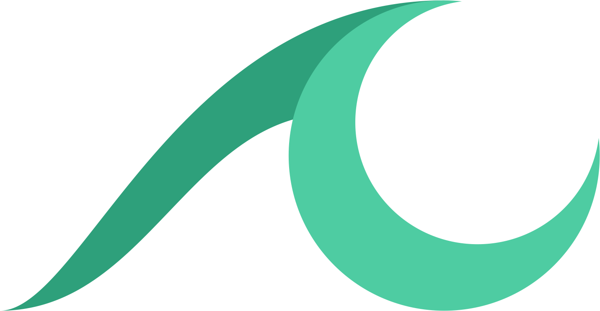

# </img>&nbsp;&nbsp;LunaSea

LunaSea is a fully featured, open source self-hosted controller! Focused on giving you a seamless experience between all of your self-hosted media software, LunaSea supports:

- [Lidarr](https://github.com/lidarr/lidarr)
- [Radarr](https://github.com/radarr/radarr)
- [Sonarr](https://github.com/sonarr/sonarr)
- [NZBGet](https://github.com/nzbget/nzbget)
- [SABnzbd](https://github.com/sabnzbd/sabnzbd)
- [Newznab Indexer Searching](https://newznab.readthedocs.io/en/latest/misc/api/)
- [NZBHydra2](https://github.com/theotherp/nzbhydra2)
- [Tautulli](https://github.com/Tautulli/Tautulli)
- [Wake on LAN](https://en.wikipedia.org/wiki/Wake-on-LAN)

LunaSea even comes with support for multiple instances of applications using profiles, backing up and restoring your configuration to your filesystem, an AMOLED black theme, and more!

> Please note that LunaSea is purely a remote control application, it does not offer any functionality without software installed on a server/computer.

## Getting Started

- [Releases](https://github.com/CometTools/LunaSea/releases)
  - [(Android) Play Store](https://www.lunasea.app/playstore)
  - [(iOS) App Store](https://www.lunasea.app/appstore)
  - [(macOS) GitHub](https://github.com/CometTools/LunaSea/releases)
  - [(macOS) Homebrew](https://formulae.brew.sh/cask/lunasea)
- [Build Guide](https://github.com/CometTools/LunaSea/wiki/Build-Guide)
  - [(Android) Keystore Setup](https://github.com/CometTools/LunaSea/wiki/Configure-Keystore)
  - [(iOS) Development Certificate Setup](https://github.com/CometTools/LunaSea/wiki/Setup-of-Development-Certificate)
- [Documentation](https://www.lunasea.app/docs)
- [Feedback & Feature Requests Board](https://www.lunasea.app/feedback)
- [Frequently Asked Questions](https://docs.lunasea.app/getting-started/frequently-asked-questions)

## Support

**Please only post bugs and issues to GitHub**. Use the [feedback & feature requests board](https://www.lunasea.app/feedback) for requests and general feedback.

- [Discord](https://www.lunasea.app/discord)
- [Email](mailto:hello@comet.tools)
- [GitHub (Issues & Bug Reports Only)](https://github.com/CometTools/LunaSea/issues)
- [Reddit](https://www.lunasea.app/reddit)
- [Website](https://www.lunasea.app)

## Tools & Services

Thank you to all tools and services for offering free subscriptions for open-source projects!

- [Gitbook](https://www.gitbook.com): Gitbook is used to host LunaSea's documentation
- [Hellonext](https://www.hellonext.co): Hellonext is used to host LunaSea's feedback board and roadmap
- [Instatus](https://instatus.com): Instatus is used to host LunaSea's status page
- [Weblate](https://weblate.org): Weblate is used to gather community localization for LunaSea

## Contributors

<!-- ALL-CONTRIBUTORS-BADGE:START - Do not remove or modify this section -->

<!-- ALL-CONTRIBUTORS-BADGE:END -->

Thank you to everyone who has helped contribute to LunaSea, from development to localization efforts!

<!-- ALL-CONTRIBUTORS-LIST:START - Do not remove or modify this section -->
<!-- prettier-ignore-start -->
<!-- markdownlint-disable -->
<table>
  <tr>
    <td align="center"><a href="https://www.jagandeepbrar.io"> <b>Jagandeep Brar</b></a> <a href="https://github.com/CometTools/LunaSea/commits?author=JagandeepBrar" title="Code">💻</a> <a href="#design-JagandeepBrar" title="Design">🎨</a> <a href="#ideas-JagandeepBrar" title="Ideas, Planning, & Feedback">🤔</a></td>
    <td align="center"><a href="https://github.com/lightglitch"> <b>Mário Franco</b></a> <a href="https://github.com/CometTools/LunaSea/commits?author=lightglitch" title="Code">💻</a> <a href="#translation-lightglitch" title="Translation">🌍</a></td>
    <td align="center"><a href="https://pythonexplainedto.me/"> <b>Patrik Hauguth</b></a> <a href="#translation-Phaugt" title="Translation">🌍</a></td>
    <td align="center"><a href="https://liberapay.com/kingu/"> <b>Allan Nordhøy</b></a> <a href="#translation-comradekingu" title="Translation">🌍</a></td>
    <td align="center"><a href="https://github.com/cpt-kuesel"> <b>cpt-kuesel</b></a> <a href="#translation-cpt-kuesel" title="Translation">🌍</a></td>
    <td align="center"><a href="https://github.com/KovalevArtem"> <b>KovalevArtem</b></a> <a href="#translation-KovalevArtem" title="Translation">🌍</a></td>
    <td align="center"><a href="https://github.com/iFelix18"> <b>Davide</b></a> <a href="#translation-iFelix18" title="Translation">🌍</a></td>
  </tr>
  <tr>
    <td align="center"><a href="https://github.com/AliMickey"> <b>Micky</b></a> <a href="https://github.com/CometTools/LunaSea/commits?author=AliMickey" title="Documentation">📖</a></td>
    <td align="center"><a href="https://ersen.srht.site/"> <b>Oğuz Ersen</b></a> <a href="#translation-ersen0" title="Translation">🌍</a></td>
    <td align="center"><a href="https://github.com/bittin"> <b>bittin</b></a> <a href="#translation-bittin" title="Translation">🌍</a></td>
    <td align="center"><a href="https://github.com/almontegil"> <b>Gil</b></a> <a href="#translation-almontegil" title="Translation">🌍</a></td>
    <td align="center"><a href="https://github.com/TheSander562"> <b>Sander Lambrechts</b></a> <a href="#translation-TheSander562" title="Translation">🌍</a></td>
    <td align="center"><a href="https://github.com/Guilhermerrrr"> <b>Guilhermerrrr</b></a> <a href="#translation-Guilhermerrrr" title="Translation">🌍</a></td>
    <td align="center"><a href="https://github.com/Ben-Wallner"> <b>Ben Biber</b></a> <a href="#translation-Ben-Wallner" title="Translation">🌍</a></td>
  </tr>
  <tr>
    <td align="center"><a href="https://github.com/Sytom"> <b>Sytom</b></a> <a href="#translation-Sytom" title="Translation">🌍</a></td>
    <td align="center"><a href="https://xxzj990.top"> <b>xxzj990</b></a> <a href="#translation-xxzj990" title="Translation">🌍</a></td>
    <td align="center"><a href="https://github.com/Qstick"> <b>Qstick</b></a> <a href="https://github.com/CometTools/LunaSea/commits?author=Qstick" title="Code">💻</a></td>
    <td align="center"><a href="https://www.openflixr.com"> <b>Mark Frelink</b></a> <a href="#translation-mfrelink" title="Translation">🌍</a></td>
    <td align="center"><a href="https://github.com/diemade"> <b>diemade</b></a> <a href="#translation-diemade" title="Translation">🌍</a></td>
    <td align="center"><a href="https://feikojoosten.com"> <b>Feiko Joosten</b></a> <a href="#translation-FeikoJoosten" title="Translation">🌍</a></td>
    <td align="center"><a href="https://github.com/TheMaxul"> <b>TheMaxul</b></a> <a href="#translation-TheMaxul" title="Translation">🌍</a></td>
  </tr>
  <tr>
    <td align="center"><a href="http://www.xrths.fr"> <b>xrths</b></a> <a href="https://github.com/CometTools/LunaSea/commits?author=xrths" title="Documentation">📖</a></td>
  </tr>
</table>

<!-- markdownlint-restore -->
<!-- prettier-ignore-end -->

<!-- ALL-CONTRIBUTORS-LIST:END -->
