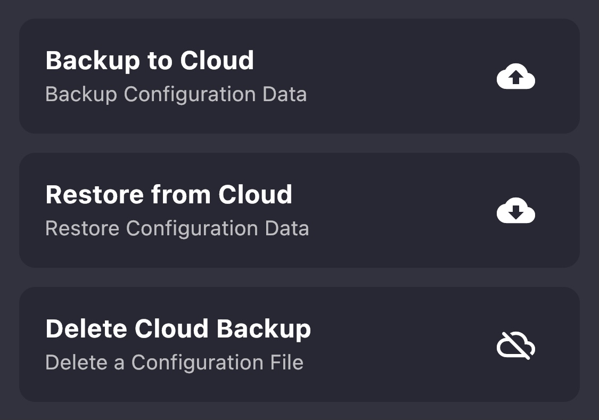

# Account

## Getting Started

LunaSea currently offers a **free** cloud account that can be used for extending the functionality of LunaSea. The only details required to register for an account are an email address and password. At no point will LunaSea or the developers send you any emails, unless you explicitly request a password reset email.


If you want to protect your privacy, you are free to use a fake email when registering for an account, as there is no required account verification.

Be warned that you will be unable to reset or change your password if you decide to use a fake email, as these functions are handled through Firebase Authentication via email.


## Encrypted Cloud Configuration Storage

The three options related to backing up your encrypted backups should be self-explanatory. All configurations are encrypted **on-device** before being sent off the device. When restoring an encrypted backup, the encrypted backup is downloaded to the device and you will be prompted to decrypt the backup **on-device**.

Deleting a backup is a permanent action, there is **no way to restore that backup**.


Because all encryption and decryption occurs on-device, it is fully end-to-end encrypted. Forgetting the encryption password will result in there being no way to retrieve the configuration.


