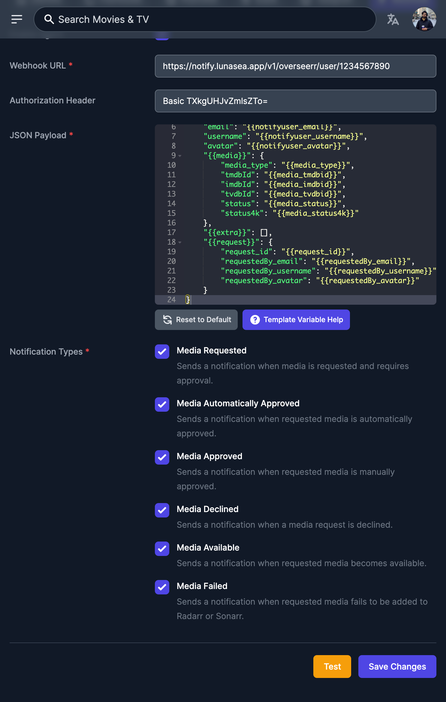

# Overseerr

## Preparation

* Read through the main [Notifications](./) page
* Copy your device-based or user-based webhook URL from LunaSea

## Setup the Webhook

Open Overseerr's web GUI, open the Settings, enter the "Notifications" tab, and select "Webhook". Ensure that the agent is enabled, then follow each tab below to setup the webhook:



Paste the full device-based or user-based URL that was copied from LunaSea.

Overseerr currently only supports 1 webhook, which means you can only setup a single user-based or device-based notification.




This step is only required if you are _**not**_ using the default LunaSea profile \(`default`\). LunaSea will assume the default profile when none is supplied.

Correctly setting up this field is critically important to get full deep-linking support.


To attach your profile to the webhook, we need to manually create the authorization header. This header will only contain the name of your profile, and no private information.

To create the authorization header:

1. Go to DebugBear's [Basic Auth Header Generator](https://www.debugbear.com/basic-auth-header-generator).
2. The username field should be an **exact match** to the profile that this module instance was added to within LunaSea. Capitalization and punctuation _does_ matter.
3. The password field should be kept empty.
4. Copy the generated authorization header **after** `Authorization:` .

The generated header that you should enter into Overseerr should start with `Basic`,  and look similar to: `Basic TXkgUHJvZmlsZTo=`.



LunaSea utilizes the default JSON payload from Overseerr and should require no changes.

To ensure that your default payload is up-to-date, please hit the "Reset to Default" button to update the JSON payload.



Select which events should trigger a push notification. The following triggers are supported:

| Trigger | Supported? |
| :--- | :---: |
| Media Requested | **Yes**  ✅ |
| Media Automatically Approved | **Yes**  ✅ |
| Media Approved | **Yes**  ✅ |
| Media Declined |  **Yes**  ✅ |
| Media Available |  **Yes**  ✅ |
| Media Failed | **Yes**  ✅ |



Once setup, close LunaSea and run the webhook test in Overseerr. You should receive a new notification letting you know that LunaSea is ready to receive Overseerr notifications!

## Example

An example Overseerr webhook can be seen below:

* This is a user-based notification webhook, meaning it will be sent to all devices that are linked to the user ID `1234567890`.
* The webhook is associated with the profile named `My Profile` by generating the authorization header `Basic TXkgUHJvZmlsZTo=`.

